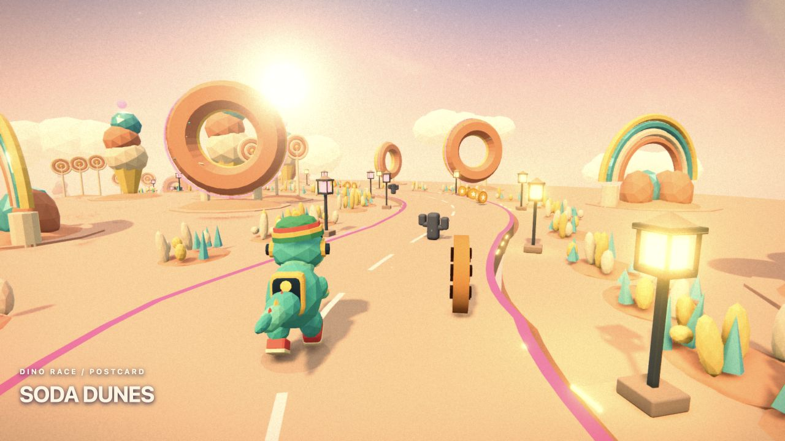
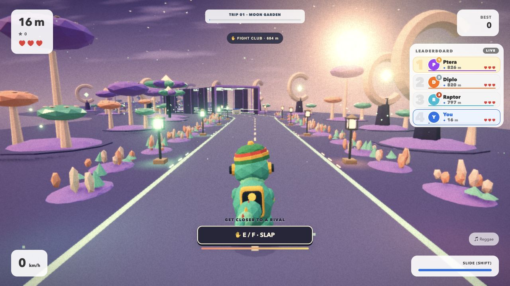
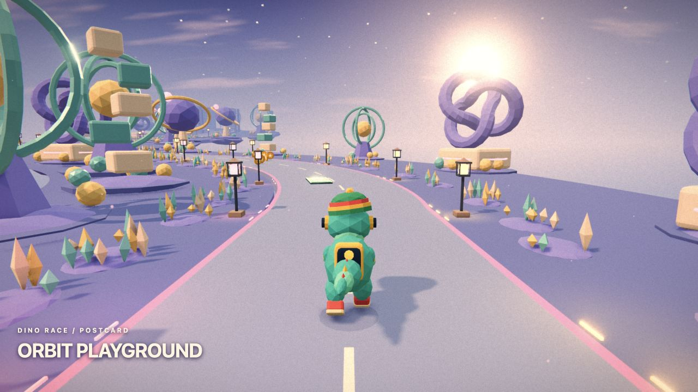

# Dino Race Fight Club

Race a dino through a surreal, ever-changing road trip — and slap your way to first place.

A colorful 3D racing game for desktop. Dodge obstacles, drift around corners, slap nearby rivals and battle in quick Fight Club duels, with a soundtrack generated live by AI.



> **PC version only for now.** The game is designed for desktop browsers with a keyboard. Mobile support is a work in progress.

## How to play

- Select **Play** to race against three bots, or **Multiplayer** to race with friends. Create a game, share its room code and start the race once everyone has joined.
- Jump between **Soda Dunes, Moon Garden, Poolside, Lava Disco and Orbit Playground**. A new race shuffles their order, scenery and tunnels; the trip keeps going after all five.
- Stay on the road, dodge cactus and cookie obstacles, and collect coins to spend in the shop. Pick your favorite dino skin and music style.
- You start with **three lives**. Outlast your rivals and see how far you can go!

## Multiplayer powered by MQTT

Race with friends directly in the browser. One player selects **Multiplayer → Create a game**, shares the room code, and starts the race once everyone has joined. No account or multiplayer API key is needed.

The game uses **MQTT over secure WebSockets (WSS)**. MQTT brokers relay messages between players in the same room, keeping their positions, slaps and Fight Club events in sync. Everyone races on the same generated track.

This hackathon version uses public brokers from **HiveMQ, Mosquitto and EMQX**, so there is no separate game server to set up. An internet connection is required.

## Controls

| Action | Desktop |
| --- | --- |
| Run | Hold ↑ or W |
| Steer | ← / → or A / D |
| Jump | Space |
| Drift | Hold Shift while steering; release to boost |
| Brake | ↓ or S |
| Slap a nearby rival | E / F or the hand button |
| Fight Club | Repeatedly press Space / E / F, or click the tap button |

**On mobile:** touch controls are a work in progress and not fully supported yet. Play on a PC with a keyboard for the best experience.

## Fight Club: three seconds to win

Every **700 meters**, an animated warning announces the next arena. The race pauses for everyone while the duel takes place, including the bots in solo mode.

- **Tap for three seconds.** The player with the most taps wins, with slaps, kicks, flips, explosions and a crowd of cheering dinos bringing the fight to life.
- **The winner steals coins:** half the loser's current-race coins, up to 20.
- **The loser loses one life**, is held still for one second, then runs at 65% speed for five seconds. Losing the last life ends their run after the finishing move.
- **A draw has no penalty.**

In solo, you fight a bot. In multiplayer, the host duels the nearest active rival while the other racers watch.

## A live AI soundtrack

**Google DeepMind Lyria RealTime** generates music as you play. Your selected music style, the pace of the race and the action influence the soundtrack, while lights and visual effects pulse to the beat.

To try it, open **Music**, paste your **Gemini API key with access to Lyria RealTime**, then select **Connect**. Turn your sound on!

You can also play without a key using the built-in synthesized soundtrack.

## A colourful road trip

Twenty low-poly landmark compositions, moving sculptures, scattered miniature gardens and three tunnel profiles make each run feel different. Warm film grain, soft halation, bloom and lifted shadows give the scene a vintage postcard look. Multiplayer racers share the same procedural seed.

The visuals reuse official **Three.js** addons under the MIT licence. See the [visual references and code credits](docs/visual-references.md).

## Skin voices

Every skin has **its own voice** and shouts a short line when it slaps a rival, adding personality to each fight.

We used **Gradium** to generate voices during the hackathon. The project also includes **Gemini TTS** generation for skin voice clips. The clips are created ahead of time and shipped with the game, so players need no API key to hear them. Toggle **Skin voices** in the Music panel to turn them on or off.

## Run the game locally

```sh
npm install
npm run dev
```

Open **http://localhost:5173** in your browser, then select **Play**.

## More screenshots

**Moon Garden**



**Orbit Playground**



**Fight Club flips**


**The finishing blow**


