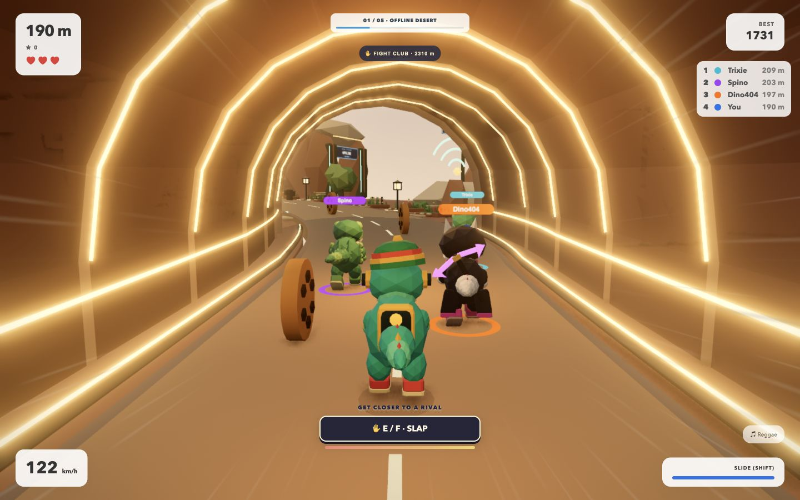
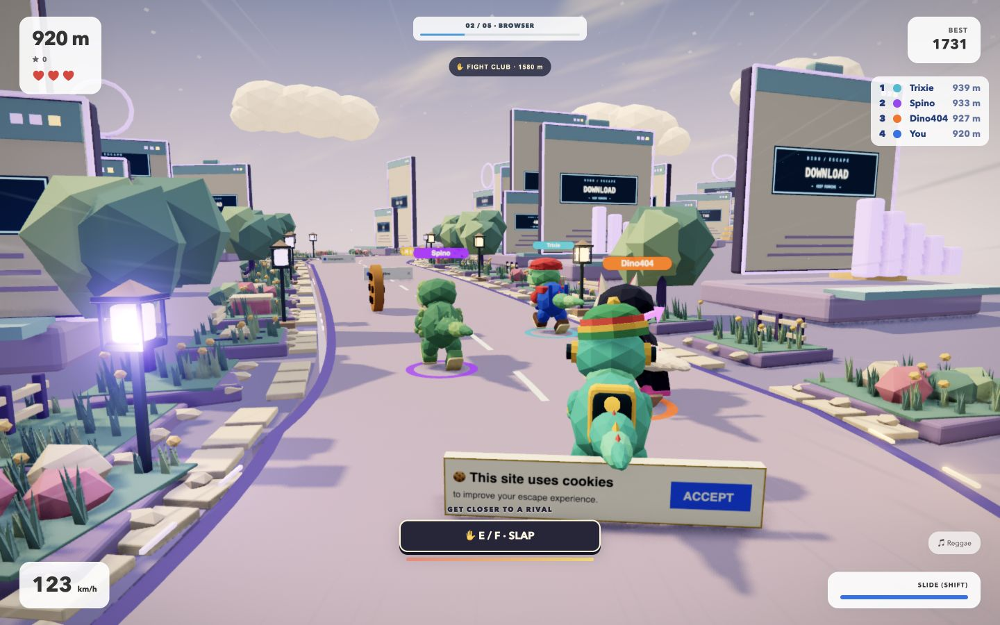
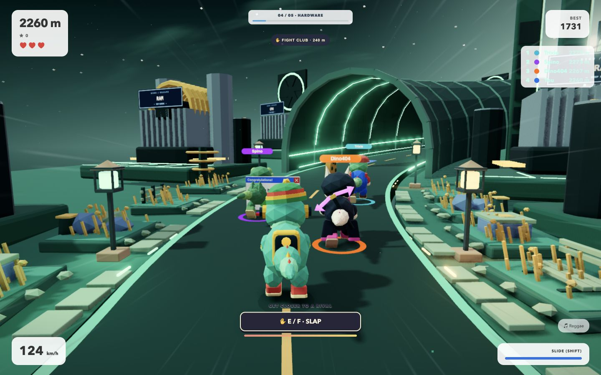
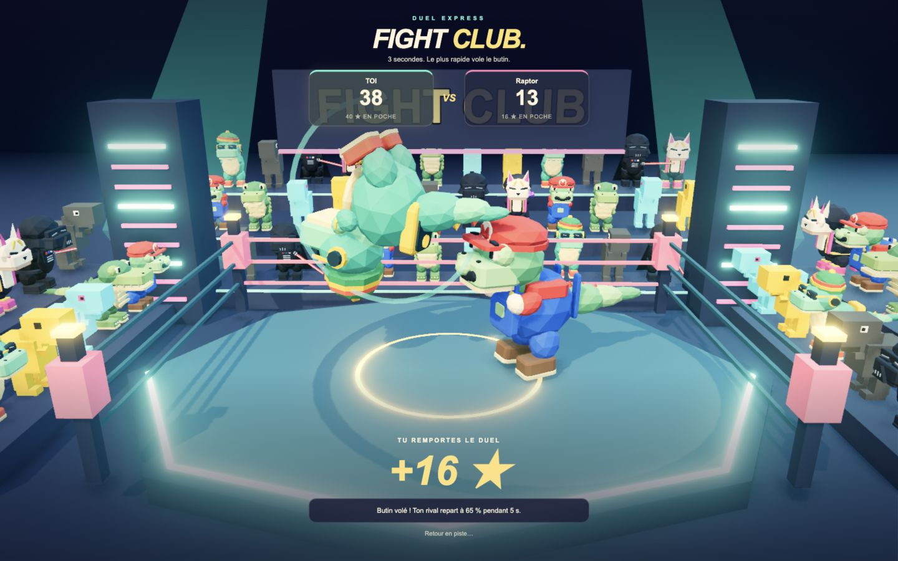
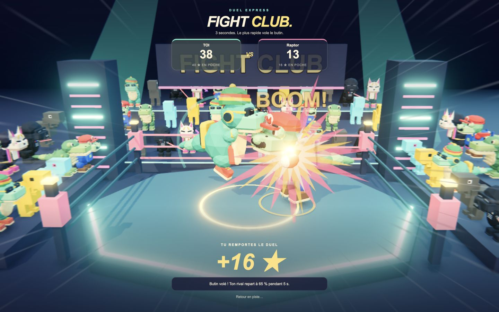

# Dino Race Fight Club

The offline dinosaur is escaping the browser — and taking the fight with it.

A colorful 3D racing game for desktop and mobile. Dodge obstacles, drift around corners, slap nearby rivals and battle in quick Fight Club duels, with a soundtrack generated live by AI.



## How to play

- Select **Play** to race against three bots, or **Multiplayer** to race with friends. Create a game, share its room code and start the race once everyone has joined.
- Escape through five worlds: **Offline Desert → Browser → Windows → Hardware → Cloud**.
- Stay on the road, dodge cactus and cookie obstacles, and collect coins to spend in the shop. Pick your favorite dino skin and music style.
- You start with **three lives**. Outlast your rivals and see how far you can go!

## Multiplayer powered by MQTT

Race with friends directly in the browser. One player selects **Multiplayer → Create a game**, shares the room code, and starts the race once everyone has joined. No account or multiplayer API key is needed.

The game uses **MQTT over secure WebSockets (WSS)**. MQTT brokers relay messages between players in the same room, keeping their positions, slaps and Fight Club events in sync. Everyone races on the same generated track.

This hackathon version uses public brokers from **HiveMQ, Mosquitto and EMQX**, so there is no separate game server to set up. An internet connection is required.

## Controls

| Action | Desktop |
| --- | --- |
| Run | Hold ↑ or W |
| Steer | ← / → or A / D |
| Jump | Space |
| Drift | Hold Shift while steering; release to boost |
| Brake | ↓ or S |
| Slap a nearby rival | E / F or the hand button |
| Fight Club | Repeatedly press Space / E / F, or click the tap button |

**On mobile:** hold the left or right half of the screen to run and steer, swipe up to jump, use two fingers to drift and tap the hand button to slap. In Fight Club, tap the big button as fast as you can.

## Fight Club: three seconds to win

Every **1,000 meters**, an animated warning announces the next arena. The race pauses for everyone while the duel takes place, including the bots in solo mode.

- **Tap for three seconds.** The player with the most taps wins, with slaps, kicks, flips, explosions and a crowd of cheering dinos bringing the fight to life.
- **The winner steals coins:** half the loser's current-race coins, up to 20.
- **The loser loses one life**, is held still for one second, then runs at 65% speed for five seconds. Losing the last life ends their run after the finishing move.
- **A draw has no penalty.**

In solo, you fight a bot. In multiplayer, the host duels the nearest active rival while the other racers watch.

## A live AI soundtrack

**Google DeepMind Lyria RealTime** generates music as you play. Your selected music style, the pace of the race and the action influence the soundtrack, while lights and visual effects pulse to the beat.

To try it, open **Music**, paste your **Gemini API key with access to Lyria RealTime**, then select **Connect**. Turn your sound on!

You can also play without a key using the built-in synthesized soundtrack.

## Skin voices

Every skin has **its own voice**: when a dino slaps, it shouts a one-to-three-word line from its own inventory (a deep menacing Vader, a cheerful Mario plumber, a chill reggae Riddim, an offline Classic robot...). The clips are **generated ahead of time** with Gemini TTS (`npm run voices:gen`, key in `.env`) into `public/voices/` and shipped with the game, so players need no key and no API call. Turn them off with the **Skin voices** checkbox in the Music panel.

## Run the game locally

```sh
npm install
npm run dev
```

Open **http://localhost:5173** in your browser, then select **Play**. To test on a phone on the same Wi-Fi network, use the network address printed in the terminal.

## More screenshots

**Inside the browser**



**Through the hardware**



**Fight Club flips**



**The finishing blow**


